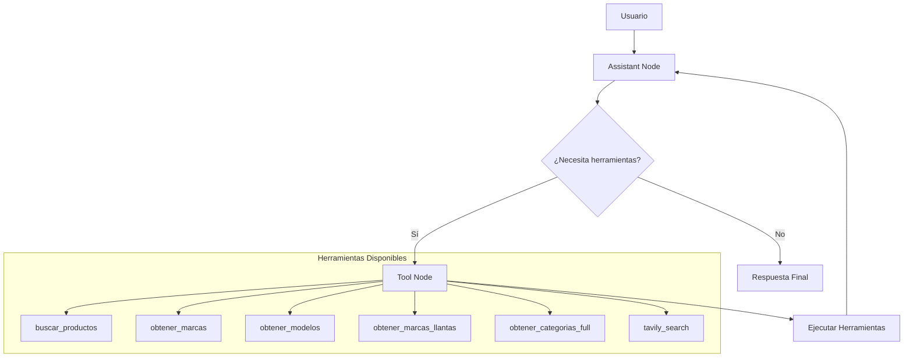

# MundiBot 🤖

**Asistente conversacional inteligente para búsqueda de repuestos de motos y llantas**

MundiBot es una solución de agentic RAG (Retrieval-Augmented Generation) diseñada para facilitar la identificación de productos mediante lenguaje natural en un catálogo extenso de más de 25,000 productos, 18+ marcas y múltiples categorías especializadas.

## 🎯 Objetivo

Resolver el desafío de búsqueda en catálogos complejos permitiendo a los usuarios encontrar repuestos y llantas específicos usando descripciones naturales como:
- *"Busco pastillas de freno para mi Honda CB 190R"*
- *"Necesito una llanta trasera 140/70-17 para mi moto deportiva"*
- *"Quiero un filtro de aire genérico para Yamaha FZ16"*

## 📊 Base de Conocimiento

### Datos Crudos
- **Origen**: Catálogo Shopify de la empresa cliente con 27,479 productos iniciales
- **Campos principales**: título, descripción, marca (vendor), tipo de producto, precio, tags, URL
- **Limpieza aplicada**: 
  - Exclusión de productos con precio 0 (agotados)
  - Filtrado por marcas con ≥70 registros
  - Normalización de campos y categorías

### Estadísticas Finales
- **26,642 productos** procesados
- **18 marcas principales**: YAMAHA (5,465), GENERICO (4,204), BAJAJ (3,977), SUZUKI (3,344), HONDA (3,133), entre otras
- **4 marcas de llantas especializadas**: MICHELIN, PIRELLI, KONTROL, METZELER
- **10+ categorías principales**: FRENOS, TRANSMISION, MOTOR, LLANTAS, ELECTRICO, etc.

## 🔄 Pipeline de Procesamiento

### 1. Exploración y Entendimiento de Datos
**Notebook**: `0_exploracion_datos.ipynb`

- Análisis de completitud (campos nulos, precios cero)
- Distribución de palabras en títulos (promedio: 7 palabras) y descripciones (promedio: 79 palabras)
- Identificación de marcas de llantas vs. repuestos generales
- Detección de patrones en tags y tipos de productos

### 2. Enriquecimiento Semántico con IA
**Notebooks**: `1_0_enriquecimiento_semantico.ipynb`, `1_1_referencias.ipynb`
**Script de producción**: `src/scripts/models_extraction_batch.py`

#### Categorización Inteligente
- **Categorías generales**: Clasificación de **433 tipos de productos** en **15 categorías** principales usando reglas regex y texto normalizado
- **Subcategorías**: Preservación del tipo original como subtipo específico
- **Cobertura**: 96.6% de productos categorizados automáticamente

#### Extracción de Modelos de Motos
- **Procesamiento por lotes**: Uso de GPT-4o-mini para extraer referencias de modelos por marca
- **Chains con LLM**: Implementación de chains especializadas para identificar patrones como "CB 190R", "XTZ 150", "Pulsar 200 NS"
- **Consolidación**: Agrupación de variantes (ej: "PULSAR 180", "Pulsar 180 DTS-i", "PULSAR 180 GT") bajo referencias base
- **Matching inteligente**: Sistema de regex para asociar títulos de productos con modelos específicos

#### Detección de Dimensiones para Llantas
- **Extracción automática**: Patrones regex para dimensiones como `90/90-10`, `130/70-17`
- **Validación por tags**: Uso de etiquetas estructuradas como `ANCHO_120`, `ALTO_70`, `RIN_17`

### 3. Indexación Híbrida y Recuperación
**Notebooks**: `2_0_exploracion_indexacion.ipynb`, `2_1_uso_retriever.ipynb` - `2_4_retriever_catalogo.ipynb`
**Implementación**: `src/core/retriever/`, `src/core/domains/`

#### Arquitectura Híbrida (Dense + Sparse)
- **Vectores Densos**: OpenAI `text-embedding-3-small` (1536 dims) para similitud semántica
- **Vectores Dispersos**: SPLADE (`prithivida/Splade_PP_en_v1`) para coincidencias exactas tipo BM25
- **Fusión RRF**: Reciprocal Rank Fusion para combinar ambos enfoques
- **Motor**: Qdrant como base de datos vectorial

#### Filtros Estructurados
- **Metadatos indexados**: marca, categoría, tipo_repuesto (`ORIGINAL/GENERICO`), `es_llanta`, dimensiones
- **Optimización**: Solo filtros que mejoran precisión sin sobre-restricción (ver `tools.py`)

#### Construcción de Texto para Embeddings
```python
# Ejemplo de texto estructurado para vectorización:
"Llanta Michelin S1 90/90-10 Delantera/Trasera - Original
Marca: MICHELIN"
```

### 4. Agente MundiBot con Patrón Agentic RAG
**Notebook**: `3_1_pruebas_agentic_rag_mundibot.ipynb`
**Implementación**: `src/graphs/mundibot/`

#### ¿Qué es Agentic RAG?
Patrón de diseño que combina agentes autónomos con recuperación aumentada, donde el sistema:
- **Gestiona dinámicamente** estrategias de búsqueda
- **Refina iterativamente** la comprensión del contexto  
- **Utiliza herramientas especializadas** para tareas complejas
- **Adapta el comportamiento** según la intención del usuario

#### Herramientas Disponibles

| Herramienta | Propósito | Ejemplo de Uso |
|-------------|-----------|----------------|
| `buscar_productos` | Búsqueda híbrida de productos | *"Pastillas freno Honda CB190R"* |
| `obtener_marcas` | Lista marcas de motos disponibles | Validación y sugerencias |
| `obtener_marcas_llantas` | Lista marcas de llantas | *"MICHELIN, PIRELLI, KONTROL, METZELER"* |
| `obtener_modelos` | Modelos por marca o todos | Mapeo modelo → marca |
| `obtener_categorias_full` | Categorías con descripciones | Navegación de catálogo |
| `tavily_search` | Búsqueda web | Dimensiones de llantas, asesoría técnica |

#### Flujo del Agente



#### Lógica de Decisión Inteligente
- **Intención detectada**: Distingue entre búsqueda de repuestos, llantas o asesoría técnica
- **Validación contra catálogo**: Verifica marcas y categorías contra listas cerradas
- **Búsqueda web contextual**: Obtiene dimensiones de llantas o explica síntomas técnicos
- **Construcción de consultas**: Arma texto optimizado para búsqueda híbrida

### 5. Interfaz Web con Chainlit
**Implementación**: `src/interfaces/chainlit/chainlit_app.py`

#### Características
- **Streaming en tiempo real**: Respuestas progresivas para mejor UX
- **Persistencia**: Historial de conversaciones con SQLite
- **Autenticación simple**: Sistema de credenciales para demo
- **Mensajes de inicio**: Accesos rápidos a funcionalidades comunes
- **Reanudación de chat**: Continuidad entre sesiones

#### Funcionalidades de la Interfaz
- Bienvenida personalizada con capacidades del bot
- Sugerencias automáticas de consultas comunes
- Streaming de respuestas para interacción fluida
- Persistencia de historial por usuario
- Manejo de errores con mensajes informativos

## ⚙️ Configuración y Variables de Entorno

### Archivo `.env` Requerido
```bash
# IA y Embeddings
OPENAI_API_KEY=tu-openai-api-key

# Base de datos vectorial Qdrant
QDRANT_HOST=localhost
QDRANT_PORT=6333

# Búsqueda web (opcional)
TAVILY_API_KEY=tu-tavily-api-key

# Monitoreo LangSmith (opcional)
LANGSMITH_TRACING=true
LANGSMITH_ENDPOINT=https://api.smith.langchain.com
LANGSMITH_API_KEY=tu-langsmith-api-key
LANGSMITH_PROJECT=mundibot
```

### Configuraciones Qdrant
**Archivo**: `src/core/settings.py`

- **Host/Puerto**: Configurable via variables de entorno
- **Modelos de embedding**: OpenAI text-embedding-3-small + SPLADE sparse
- **Dimensiones**: 1536 para vectores densos
- **Índices de payload**: Optimizados para filtros frecuentes
- **Timeouts y reintentos**: Configurados para robustez

## 🚀 Instalación y Uso

### Requisitos
- Python 3.11+
- Qdrant (Docker recomendado)
- Variables de entorno configuradas

### Instalación
```bash
# Clonar repositorio
git clone <repo-url>
cd mundibot

# Instalar dependencias
uv sync
# o con pip
pip install -e .

# Configurar variables de entorno
cp .env.example .env
# Editar .env con tus API keys
```

### Iniciar Qdrant
```bash
# Con Docker
docker run -p 6333:6333 qdrant/qdrant

# O con docker-compose
docker-compose -f docker/compose.qdrant.yml up -d
```

### Ejecutar MundiBot

#### Interfaz Web (Recomendado)
```bash
chainlit run src/interfaces/chainlit/chainlit_app.py -w
```

#### Uso Programático
```python
from src.graphs.mundibot import create_mundibot_graph, get_default_config

# Crear grafo
graph = await create_mundibot_graph()
config = get_default_config()

# Conversación
input_state = {"messages": [("user", "Busco pastillas de freno para CB 190R")]}
async for event in graph.astream(input_state, config):
    print(event)
```

### Indexar Datos (Primera vez)
```python
# Ver notebooks/2_2_indexacion_catalogo_repuestos.ipynb
from src.core.retriever import RetrieverSystemManager
from src.scripts.product_indexing import main

# Ejecutar indexación
await main()
```

## 🏗️ Arquitectura del Sistema

```
mundibot/
├── src/
│   ├── core/
│   │   ├── domains/products/     # Servicios de catálogo y búsqueda
│   │   ├── retriever/           # Sistema híbrido Qdrant
│   │   └── settings.py          # Configuración centralizada
│   ├── graphs/mundibot/         # Agente conversacional
│   │   ├── tools.py            # Herramientas especializadas
│   │   ├── prompts.py          # Prompt del sistema
│   │   └── graph.py            # Flujo del agente
│   ├── chains/                  # Cadenas de procesamiento IA
│   │   └── preprocessing/       # Enriquecimiento semántico
│   ├── interfaces/chainlit/     # Interfaz web
│   └── scripts/                 # Scripts de indexación
├── notebooks/                   # Exploración y desarrollo
├── data/                        # Datos procesados (gitignored)
└── docs/                        # Documentación técnica
```

## 📈 Resultados y Beneficios

- **Búsqueda inteligente**: Comprende consultas naturales sin sintaxis específica
- **Filtrado contextual**: Aplica automáticamente filtros relevantes según la intención
- **Cobertura amplia**: 96.6% de productos categorizados automáticamente
- **Precisión híbrida**: Combina similitud semántica con coincidencias exactas
- **Escalabilidad**: Arquitectura preparada para catálogos de mayor tamaño
- **Experiencia natural**: Interfaz conversacional fluida con streaming

---

*MundiBot representa una solución integral para la búsqueda inteligente en catálogos especializados, combinando técnicas avanzadas de IA con una experiencia de usuario optimizada.*
